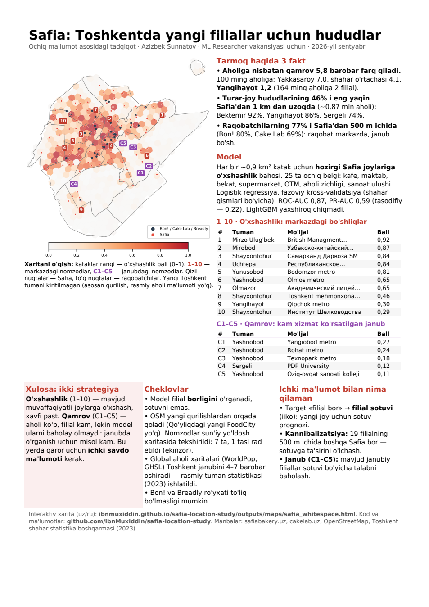

# Safia: where to open the next bakeries in Tashkent

An open-data study of the Safia bakery network in Tashkent, prepared by **Azizbek Sunnatov** as part of an
application for the ML Researcher role in Safia's AI team (September 2026). It uses only public data: no
internal Safia data was used.

**Deliverables**

| | |
|---|---|
| One-page report | [Uzbek](reports/safia_location_uz.pdf) · [Russian](reports/safia_location_ru.pdf) |
| Interactive map (uz/ru) | **[Open in the browser](https://ibnmuxiddin.github.io/safia-location-study/outputs/maps/safia_whitespace.html)** (source: [`outputs/maps/safia_whitespace.html`](outputs/maps/safia_whitespace.html)) |
| Findings with all numbers | [`docs/findings.md`](docs/findings.md) |



## Key findings

1. **Coverage per resident differs 5.8× between districts.** Yakkasaroy has 7.0 branches per 100k residents, the city
   average is 4.1, and Yangihayot has 1.2 (2 branches for 164k people).
2. **46% of residential areas are more than 1 km from the nearest Safia** (roughly 0.87 M residents). This rises to 92%
   in Bektemir, 86% in Yangihayot and 74% in Sergeli.
3. **77% of competitor branches (Bon!, Cake Lab, Breadly) are within 500 m of a Safia.** Competition is concentrated in
   the centre, and the south has little competition.
4. **Two expansion strategies emerge.** *Similarity* (top-10) finds gaps in the dense centre that resemble existing
   Safia locations, which makes them lower risk. *Coverage* (C1–C5) points to the under-served south, where the model
   cannot judge demand because there are few training examples. That decision needs Safia's internal sales data.

## Method

```
Safia site (JSON-LD, 172 branches) ─┐
Cake Lab site, OSM competitors ─────┤
OpenStreetMap POIs, land use ───────┼─► H3 grid (res 8, ~0.88 km² in Tashkent, 493 cells, 12 districts)
Official district population 2023 ─┘        │
                                             ▼
               features: cafes, schools, bus stops, supermarkets, universities, offices,
               apartments, metro, malls (cell + neighbours), district density,
               distance to centre, non-residential share          (25 features)
                                             │
                                             ▼
        target: "cell has a Safia branch"  →  logistic regression / LightGBM
        20 × spatial GroupKFold over H3 res-6 blocks, 2-ring buffer  →  mean out-of-fold score per cell
                                             │
                                             ▼
        candidates: no Safia within 1 km, ≥ 1.5 km apart, reasons from SHAP (per concept),
        checked on satellite imagery (7 checked, 1 rejected: cropland)
```

**Model results.** Validation is spatial: blocks of about 36 km² are held out together, and training cells within
2 rings (~2 km) of the test block are removed. This matters because features use each cell's neighbours, so nearby
cells share information. The assignment of blocks to folds is repeated 20 times and averaged. 107 of 493 cells
have a branch, so a random model scores 0.217 PR-AUC.

| Model | ROC-AUC | PR-AUC |
|---|---|---|
| **Logistic regression, no competitor feature (chosen)** | **0.865 ± 0.006** | **0.589 ± 0.015** |
| Logistic regression + competitor feature | 0.864 ± 0.007 | 0.589 ± 0.017 |
| LightGBM, no competitor feature | 0.855 ± 0.005 | 0.595 ± 0.015 |
| LightGBM + competitor feature | 0.855 ± 0.004 | 0.596 ± 0.010 |

(± is the spread over the 20 repeats.) The rule is to pick the simplest model within 0.01 PR-AUC of the best.
LightGBM is not better: its PR-AUC is +0.005 higher, which is within noise, and its ROC-AUC is lower. The competitor
flag adds nothing, and that data is incomplete anyway.

### Things that went wrong and were fixed

- **Global population grids fail in Tashkent.** WorldPop 2025 and GHSL 2025 correlate with official district totals
  at Spearman −0.27 and 0.01. They put 4–7× too many people in the southern districts and 2–3× too few in the
  centre. Masking industrial land did not help (0.03). Official district statistics are used instead
  ([figure](outputs/figures/06b_population.png)).
- **One validation split is not enough.** With a single spatial split, LightGBM looked +0.046 PR-AUC better than
  logistic regression. Over 30 random block-to-fold assignments, the difference was +0.005 ± 0.018, and that single
  split was the luckiest of the 30. Model choice and scores now use the average of 20 repeats. The buffer lowered
  logistic regression from 0.598 to 0.589: the plain split had been slightly optimistic.
- **Target leakage.** OSM's `cafe` category contained 3 Safia and 23 competitor cafés. They are removed from the
  features.
- **Open data lags reality.** One candidate turned out to be cropland behind a newly built FoodCity trade complex
  that is not in OSM yet. Manual checks are stored in `data/interim/candidate_checks.csv`, and rejected cells are
  excluded.

## Limitations

- The model learns where branches **are**, not how well they **sell**. Its scores measure similarity to current
  locations, not expected revenue.
- Population is official district-level data from April 2023. Variation inside a district comes only from OSM
  features.
- Bon! and Breadly lists come from OSM and may be incomplete. Cake Lab comes from its official website.
- Yangi Toshkent district (196 km², mostly construction, no official population) is excluded.

## With internal data I would

- Replace the target "branch exists" with **branch sales** (iiko) to get a sales forecast for a new location (cold start).
- Measure **cannibalisation**: 19 branches have another Safia within 500 m.
- Estimate demand in the **south (C1–C5)** from the sales of existing southern branches.

## Reproduce

Requires Python 3.13. Everything runs from the data committed in `data/raw/`, so no network access is needed.

```bash
git clone https://github.com/ibnMuxiddin/safia-location-study.git
cd safia-location-study
python -m venv .venv
.venv/Scripts/python -m pip install -r requirements.lock.txt      # Windows (Linux/macOS: .venv/bin/python)
.venv/Scripts/python src/run_all.py                              # steps 01 → 12, about 2 minutes
```

Each step is one script, `src/NN_name.py`. Scripts that download data (02, 03, 04, 05, 06, 06b) only do so when the
cached file is missing or `--refresh` is passed. The raw HTML of the Safia and Cake Lab pages is not redistributed.
Steps 02 and 05 use the extracted branch tables in `data/interim/safia_branches.csv` and
`data/raw/cakelab_branches.csv` instead. `--refresh` downloads today's pages, so results may then differ.

```
src/            one script per step, config.py, osm_utils.py, map_utils.py, run_all.py
data/raw/       source data as downloaded (Safia/Cake Lab pages, OSM extracts, boundaries)
data/interim/   cleaned tables (branches, competitors, official population, manual checks)
data/processed/ features, model outputs, top-10, coverage list, facts.json
outputs/        maps and figures        reports/   one-page PDFs        docs/   findings
```

## Data sources and licences

- Branch locations: [safiabakery.uz](https://safiabakery.uz/en/locations) and [cakelab.uz](https://cakelab.uz/ru/branches),
  public pages, fetched once on 2026-09-28.
- Map data © [OpenStreetMap contributors](https://www.openstreetmap.org/copyright), ODbL.
- Population: Tashkent city statistics department, 2023-04-01, as reported by [uznews.uz](https://uznews.uz/ru/news/64477).
- Compared and rejected: GHSL GHS-POP R2023A (European Commission, JRC; CC BY 4.0) and WorldPop Global2 R2025A
  (CC BY 4.0, doi:10.5258/SOTON/WP00839).
- Satellite imagery in the check map: Esri World Imagery.
